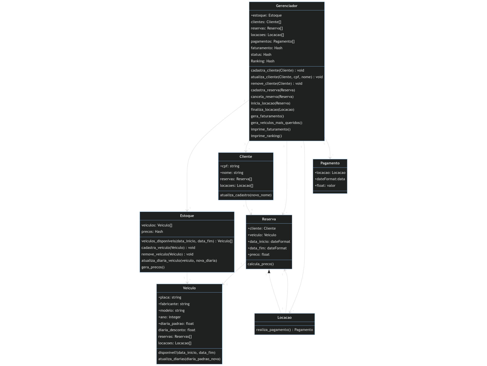
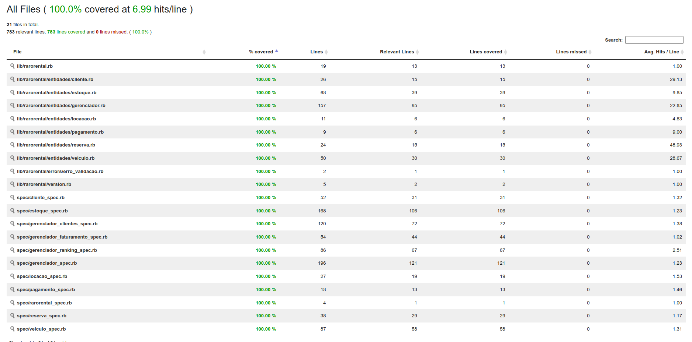
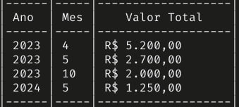
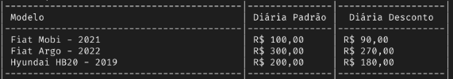
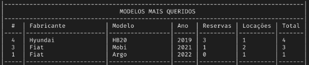

- [Raro Rental Cars](#raro-rental-cars)
  - [Projeto](#projeto)
    - [Diagrama](#diagrama)
  - [Objetivos](#objetivos)
    - [Deve ser possível](#deve-ser-possível)
    - [Não deve ser possível](#não-deve-ser-possível)
    - [Deve ser garantido](#deve-ser-garantido)
  - [Considerações importantes](#considerações-importantes)
    - [Resoluções de problemas](#resoluções-de-problemas)
    - [Descrição dos testes](#descrição-dos-testes)
    - [Métodos de impressão](#métodos-de-impressão)
      - [Método de imprimir tabela de faturamento no terminal](#método-de-imprimir-tabela-de-faturamento-no-terminal)
      - [Método de imprimir tabela de tabela de preços no terminal](#método-de-imprimir-tabela-de-tabela-de-preços-no-terminal)
      - [Método de imprimir de ranking do veículos mais queridos no terminal](#método-de-imprimir-de-ranking-do-veículos-mais-queridos-no-terminal)
  - [Instalação](#instalação)

# Raro Rental Cars

## Projeto

O projeto de estudo consiste em criar uma aplicação em Ruby que administra uma locadora de veículos. Respeitando o enunciado descrito [aqui](/.gitlab/enunciado.txt). O projeto foi desenvolvido com o intuito de praticar os conceitos de orientação a objetos e testes unitários.

### Diagrama

Primeiro foi criado um diagrama de classes para compreender melhor o problema e como seria a solução. Durante o processo houve algumas alterações de acordo com as necessidades e o melhor entendimento do problema.



[Código do diagrama](./.gitlab/diagrama.txt) feito com [mermaid](https://mermaid.live/)

## Objetivos

A missão é criar um sistema para gerenciar uma empresa de locação de veículos.

- Cadastro de Veículos

  - Para cadastrar um veículo no estoque é necessário informar a placa, o fabricante, o modelo e o ano do veículo. O sistema deve permitir gerenciar a frota. Ou seja permitir o registro da aquisição de novos veículos bem como sua retirada do estoque por qualquer motivo.

- Tabela de Preços

  - Para cada tipo de veículo (fabricante/modelo) é definida uma tabela de preços para o valor da diária para locação até 6 dias e um valor com desconto para locações com mais de 6 dias.

- Clientes

  - Os clientes são identificados pelo CPF e seu nome completo. O sistema deve permitir manter um cadastro atualizado de todos os clientes.

- Reservas

  - Um cliente pode realizar apenas uma reserva simultânea. Uma reserva significa que um veiculo será alocado para um determinado cliente em um determinado período.

- Locação

  - Quando o cliente retira de fato o veículo da loja, a reserva dá origem a locação. A locação termina com a devolução do veículo e sua reentrada no estoque.

### Deve ser possível

- [x] 1 - Deve ser possível adicionar um novo veículo ao estoque.
- [x] 2 - Deve ser possível remover um veículo do estoque.
- [x] 3 - Deve ser possível incluir um novo cliente no sistema.
- [x] 4 - Deve ser possível realizar uma alteração no nome de um cliente já existente.
- [x] 5 - Deve ser possível buscar quais veículos estarão disponíveis em um determinado período. O resultado da busca deve mostrar o valor que será pago pela reserva respeitando a tabela de preços.
- [x] 6 - Deve ser possível criar uma reserva para um veículo disponível.
- [x] 7 - Deve ser possível transformar uma locação em reserva.
- [x] 8 - Deve ser possível finalizar uma locação.
- [x] 9 - Deve ser possível gerar um relatório mensal com o faturamento da empresa.
- [x] 10 - Deve ser possível gerar um relatório com a lista de veículos mais queridos pelos clientes.
- [x] 11 - Deve ser possível alterar a tabela de preços.

### Não deve ser possível

- [x] 1 - Não deve ser possível remover um veículo em locação do estoque.
- [x] 2 - Não deve ser possível remover um cliente da base que já realizou uma reserva ou locação.
- [x] 3 - Não deve ser possível ter mais de uma reserva sobreposta para um mesmo veículo.
- [x] 4 - Não deve ser possível incluir um cliente duplicado na base.
- [x] 5 - Não deve ser possível incluir um veículo duplicado na base.

### Deve ser garantido

- [x] 1 - Que se houver alteração no preço da tabela, os relatórios anteriores ao período da alteração não mudem os valores.

## Considerações importantes

#### Resoluções de problemas

Inicialmente foi pensado na estrutura de Classes necessária, seus relacionamentos e por último suas funcionalidades.
A implementação das classes no código foi iniciada seguindo a árvore gerada no diagrama, de baixo para cima. Sempre implementando primeiro os arquivos de testes, conforme estrutura descrita no próximo tópico.

8 - Deve ser possível finalizar uma locação.
9 - Deve ser possível gerar um relatório mensal com o faturamento da empresa.

- Atrelada a resolução do problema 8, foi implementada também a resolução do problema 9.
  O metodo de finalizar a locação (que pertence a classe Gerenciador), além de enviar o veículo novamente para o estoque também gera o pagamento e envia suas informações para a lista de faturamento, que irá fornecer as informações para gerar o relatório mensal de faturamento da empresa.

10 - Deve ser possível gerar um relatório com a lista de veículos mais queridos pelos clientes.

- A classe Gerenciador também está responsável pelo metodo que resolve esse problema. A classe possui listas que constam os veículos mais locados e repassa essas informações para o metodo que gera o relatório de veículos mais queridos.

11 - Deve ser possível alterar a tabela de preços.

- A solução desse ponto foi implementada utilizando as classes Veículo e Gerenciador. Ao iniciar uma instância de Veículo é obrigatório informar o seu preço. A classe Gerenciador inclui um metodo para alterar o preço de um veículo, onde também são guardadas listas com essas informações, essas listas por suas vez são acessadas pelo metodo de gerar tabela. Sendo assim, na fonte de dados da tabela sempre haverá o preço atual do veículo.

#### Descrição dos testes

Os testes foram implementados por Classes, para cada metodo foram construídos os contextos: "Quando dado parametros válidos" e "Quando dado parametros inválidos". Em alguns metodos mais simples não se fez necessário a divisão por contextos. [Aqui está a lista de testes](./.gitlab/testes.md).

Foi optado por implementar os testes da classe Gerenciador em quatro arquivos diferentes visando a melhor compreensão do código.

Para garantir que todas as linhas de códigos foram cobertas pelos testes foi utilizada a gem [SimpleCov](https://github.com/simplecov-ruby/simplecov). O resultado da análise pode ser verificado [aqui](./coverage/index.html).



### Métodos de impressão

São metodos que imprimem na tela os dados em forma de tabela no terminal.

#### Método de imprimir tabela de faturamento no terminal

Método responsável apenas por imprimir na tela a tabela com os dados gerados pelo método que gera o relatório mensal.



#### Método de imprimir tabela de tabela de preços no terminal

Método responsável apenas por imprimir na tela a tabela com os dados gerados pelo método que gera a tabela de preços.



#### Método de imprimir de ranking do veículos mais queridos no terminal

Método responsável apenas por imprimir na tela a tabela com os dados gerados pelo método que gera a tabela de preços.



- Veículos mais queridos foram os mais reservados.

## Instalação

Depois de clonar o repositório, entre na pasta do projeto:

Execute o comando abaixo para instalar as dependências:

```bash
    bundle install
```

Execute o comando abaixo para rodar os testes:

```bash
    rspec
```
