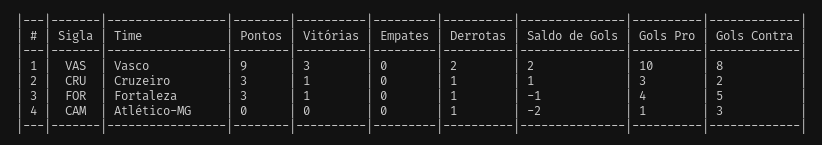

- [Raro Rental Cars](#raro-rental-cars)
  - [Projeto](#projeto)
    - [Diagrama](#diagrama)
  - [Objetivos](#objetivos)
    - [Deve ser possível](#deve-ser-possível)
    - [Não deve ser possível](#não-deve-ser-possível)
    - [Deve ser garantido](#deve-ser-garantido)
  - [Considerações importantes](#considerações-importantes)
    - [Métodos de impressão](#métodos-de-impressão)
      - [Método de imprimir tabela de faturamento no terminal](#método-de-imprimir-tabela-de-faturamento-no-terminal)
      - [Método de imprimir tabela de tabela de preços no terminal](#método-de-imprimir-tabela-de-tabela-de-preços-no-terminal)
      - [Método de imprimir de ranking do veículos mais queridos no terminal](#método-de-imprimir-de-ranking-do-veículos-mais-queridos-no-terminal)
  - [Instalação](#instalação)

# Raro Rental Cars

## Projeto

O projeto de estudo consiste em criar uma aplicação em ruby que administra um locadora de veículos. Respeitando o enunciado descrio [aqui](/.gitlab/enunciado.txt). O projeto foi desenvolvido com o intuito de praticar os conceitos de orientação a objetos e testes unitários.

### Diagrama

Primeiro foi feito um diagrama de classes para entender melhor o problema e como seria a solução. Durante o processo houve algumas alterações de acordo com as necessidades e o melhor entendimento do problema.


[Código do diagrama](./.gitlab/diagrama.txt) feito com [mermaid](https://mermaid.live/)

## Objetivos

A missão é criar um sistema gerenciar uma empresa de locação de veículos.

- Cadastro de Veículos

  - Para cadastrar um veículo no estoque é necessário informar a placa, o fabricante, o modelo e o ano do veículo. O sistema deve permitir gerenciar a frota. Ou seja permitir o registro da aquisição de novos veículos bem como sua retirada do estoque por qualquer motivo.

- Tabela de Preços

  - Para cada tipo de veículo (fabricante/modelo) é definida uma tabela de preços para o valor da diária para locação até 6 dias e um valor com desconto para locações com mais de 6 dias.

- Clientes

  - Os clientes são identificados pelo CPF e seu nome completo. O sistema deve permitir manter um cadastro atualizado de todos os clientes.

- Reservas

  - Um cliente pode realizar apenas uma reserva simultânea. Um reserva significa que um veiculo será alocado para um determinado cliente em um período.

- Locação

  - Quando o cliente retira de fato o veículo da loja, a reserva dá origem a locação. A locação termina com a devolução do veículo e sua reentrada no estoque.

### Deve ser possível

- [x] 1 - Deve ser possível adicionar um novo veículo ao estoque.
- [x] 2 - Deve ser possível remover um veículo do estoque.
- [x] 3 - Deve ser possível incluir um novo cliente no sistema.
- [x] 4 - Deve ser possível realizar uma alteração no nome de um cliente já existente.
- [x] 5 - Deve ser possível buscar quais veículos estarão disponíveis em um determinado período. O resultado da busca deve mostrar o valor que será pago pela reserva respeitando a tabela de preços.
- [x] 6 - Deve ser possível criar uma reserva para um veículo disponível.
- [x] 7 - Deve ser possível transformar uma locação em reserva.
- [x] 8 - Deve ser possível finalizar uma locação.
- [x] 9 - Deve ser possível gerar um relatório mensal com o faturamento da empresa.
- [x] 10 - Deve ser possível gerar um relatório com a lista de veículos mais queridos pelos clientes.
- [x] 11 - Deve ser possível alterar a tabela de preços.

### Não deve ser possível

- [x] 1 - Não deve ser possível remover um veículo em locação do estoque.
- [x] 2 - Não deve ser possível remover um cliente da base que já realizou uma reserva ou locação.
- [x] 3 - Não deve ser possível ter mais de uma reserva sobreposta para um mesmo veículo.
- [x] 4 - Não deve ser possível incluir um cliente duplicado na base.
- [x] 5 - Não deve ser possível incluir um veículo duplicado na base.

### Deve ser garantido

- [x] 1 - Que se houver alteração no preço da tabela, os relatórios anteriores ao período da alteração não mudem os valores.

## Considerações importantes

### Métodos de impressão

São metodos que imprimem na tela os dados em forma de tabela no terminal.

#### Método de imprimir tabela de faturamento no terminal

Método responsável apenas por imprimir na tela a tabela com os dados gerado pelo método que gera o relatório mensal.



#### Método de imprimir tabela de tabela de preços no terminal

Método responsável apenas por imprimir na tela a tabela com os dados gerado pelo método que gera a tabela de preços.


#### Método de imprimir de ranking do veículos mais queridos no terminal

Método responsável apenas por imprimir na tela a tabela com os dados gerado pelo método que gera a tabela de preços.


- Veículos mais queridos foram os mais reservados.

## Instalação

Depois de clonar o repositório, entre na pasta do projeto:

Execute o comando abaixo para instalar as dependências:

```bash
    bundle install
```

Execute o comando abaixo para rodar os testes:

```bash
    rspec
```
